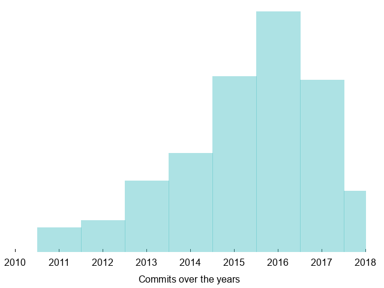

!SLIDE[bg=_images/backgrounds/white_bg.png]

# A bit of history

&nbsp;

* 2010: Rackspace and NASA create OpenStack
* 2012: OpenStack Foundation
* 2014: "The big tent"

 

~~~SECTION:notes~~~
The community evolved over the years, in size, in governance.
https://docs.openstack.org/project-team-guide/introduction.html

The OpenStack foundation was created to provide shared resources to projects,
promote openstack projects and the community around them.

The definition of what an OpenStack project is eveolved over time as well.
With the big tent, a project must follow the principles

* Hundreds of repositories
* Millions of lines of code

~~~ENDSECTION~~~
